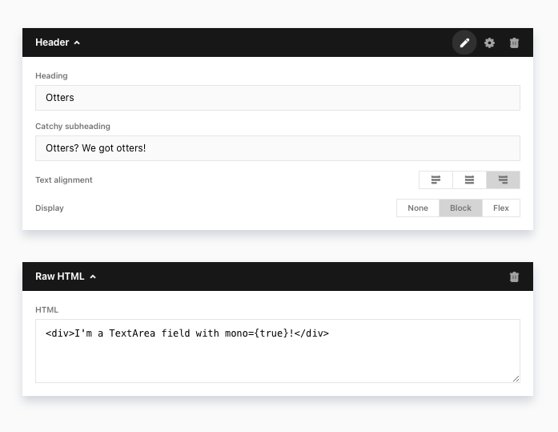

# Otter, the embeddable content editor 

[](https://travis-ci.com/bhallstein/otter)


- Embed a content editor in your app by simply ~~splashing about in bodies of water~~ defining some content models 🐟
- Simple and ~~estuarine~~ declarative block-’n-field syntax for your models 🌿
- Generates post data in an ~adorable~ accessible JSON format 💧
- Delivered as a React component that’s really ~~furry~~ easy to use 🏞


```jsx
🐟 🐟 🐟
npm i -S otter-editor
🐟 🐟 🐟
<Otter.Editor blocks={blocks}
              data={data}
              load_state={Otter.State.Loaded} />
🐟 🐟 🐟
```





### Contents

- [Otter.Editor](#ottereditor)
- [Blocks](#blocks)
- [Fields](#fields)
- [Demo](#demo)
- [CSS and Tailwind](#css-and-tailwind)
- [Tests](#tests)
- [License](#license)


## <Otter.Editor>

The `<Otter.Editor />` element renders the editor.

```jsx
<Otter.Editor blocks={blocks}
              data={data}
              load_state={Otter.State.Loaded} />
```

| Property        | Value                                           | Required | Default   |                                                                                                                                    |
| :-------------- | :---------------------------------------------  | :------- | :-------- | :--------------------------------------------------------------------------------------------------------------------------------- |
| `blocks`        | `<Array(Block)>`                                | Yes      |           | Defines the [blocks](#blocks) available in the editor.                                                                             |
| `data`          | Loaded data                                     |          |           | The loaded page data.                                                                                                              |
| `load_state`    | `Otter.State.Loading` or `.Loaded` or `.Error`  | Yes      |           | Set the editor state. Use `Loading` and `Error` to display useful feedback to the user when asynchronously fetching content data.  |
| `delegate`      | `{save: <Function>, block_toggled: <Function>}` |          |           | Used by Otter to communicate state changes to the parent.                                                                          |
| `save`          | `Otter.Save.OnInput` or `.OnClick`              |          | `OnClick` | Specify at what point Otter will call `save()` on the delegate: continuously on user inpue, or only when a save button is clicked. |
| `block_numbers` | `<bool>`                                        |          | `false`   | Label each block with its 1-based index                                                                                            |

```js
const my_delegate = {
  save(data) {
    // e.g. kick off a request to update the database
  },
  block_toggled() {
    // e.g. reflow other parts of page layout if necessary
  },
}
```


## Blocks

The Otter editor is based on content models that you define. These **block definitions** are succinct and declarative. Within a block, there will be one or more [Fields](#fields). This system lets you rapidly arrange fields into blocks to create rich content editors.

An example Block of type `PageHeader` might contain the Fields: `title`, `subtitle`, and `background_image`.

```js
{
  type: 'MyBlock',
  description: 'My block',
  fields: [
    <Field>,
    <Field>,
    ...
  ],
}
```

### Block properties

| Property      | Value              | Required | Default |                                                                                                                                                                 |
| :------------ | :----------------- | :------- | :------ | :-------------------------------------------------------------------------------------------------------------------------------------------------------------- |
| `type`        | `<string>`         | Yes      |         | The block type identifier. Each block's `type` string must be unique within the editor.                                                                         |
| `description` | `<string>`         |          |         | A human-readable name for the block, identifying it clearly to the user. If not present Otter will use a prettified version of the block type.                  |
| `fields`      | `Array(<Field>)`   | Yes      |         | The [fields](#fields) in this block.                                                                                                                            |
| `thumbnail`   | `<path>`           |          |         | Optional thumbnail for use in the [graphical block picker](#blocks-optionally-categorise-in-groups).                                                            |
| `hidden`      | `<bool>`           |          | `false` | If `true`, don't display this block in the block picker. This allows you to define blocks at the top level which can only be used in a NestedBlock or Repeater. |


### Optionally group blocks for a richer block picker

When supplying your content blocks to Otter, (`<Otter.Editor blocks={blocks} />`), you can either use a **simple, flat array** of blocks, or **group them into categories**.

```js
// Simple blocks
const blocks = [
  <Block>,
  <Block>,
  ...
]
```

```js
// Grouped blocks
const blocks = {
  text: {
    name: 'Text blocks',
    blocks: [ <Block>, <Block>, ... ],
  },
  media: {
    name: 'Media blocks',
    blocks: [ <Block>, <Block>, ... ],
  },
}
```

Otter uses a different block picker depending on whether simple or grouped blocks are used. Grouped blocks can provide a much better user experience if your editor uses many types of blocks:

| Simple block picker | Grouped block picker |
| :------------------ | :------------------- |
|  |  |


## Fields

Each block should contain at least one field.

```js
{
  name: 'content',
  description: 'Content',
  type: Otter.Fields.TextArea,
}
```

### Field properties

All fields have the following properties:

| Property        | Value                                   | Required   |                                                                                                          |
| :-------------- | :-------------------------------------- | :--------- | :------------------------------------------------------------------------------------------------------- |
| `name`          | `<string>`                              | Yes        | The block data save key.                                                                                 |
| `description`   | `<string>`                              |            | Field label displayed to the user. If not present Otter will use a prettified version of the field name. |
| `type`          | `Otter.Field.<FieldType>`               | Yes        | The [field type](#field-types).                                                                          |
| `display_if`    | `<DisplayRule>`, `Array(<DisplayRule>)` |            | Show/hide this field based on the value(s) of its sibling(s).                                            |
| `default_value` | Any type, as appropriate                |            | A default value, used to set the field initially and to provide data on save if the field is empty       |

(The `default_value` prop is not supported by TextEditor, WPMedia, NestedBlock, or Repeater.)

[Field type](#field-types) should be specified with the Otter-defined constants such as `Otter.Fields.TextInput`.

With `display_if` you can show or hide the field based on the value of one or more of its siblings. Each `DisplayRule` specifies the name of the sibling and a value. You can test against more than one sibling field using an array of multiple `DisplayRule` objects.

```js
// display_if example:
{
  name: 'url',
  description: 'URL',
  type: Otter.Fields.TextInput,
  display_if: {
    sibling: 'is_link',
    equal_to: true,
  },
}
```

Beside `equal_to`, DisplayRule supports these rule types:

| Rule type      | Value                            |                                                                            |
| :------------- | :------------------------------- | -------------------------------------------------------------------------- |
| `equal_to`     | `<value>`                        | Show the field if the sibling's value `=== <value>`                        |
| `not_equal_to` | `<value>`                        | ...if `!== <value>`                                                        |
| `matches`      | `<string> (compiled to RegExp)`  | Show the field if the sibling's value is a string which matches the regex  |
| `doesnt_match` | `<string> (compiled to RegExp)`  | ...which doesn't match the regex                                           |

Note that using `matches` and `doesnt_match` may impact the performance of typing into the sibling field mentioned, as it causes relayout to occur on input.


### Field types:

The supported field types are listed below. Many fields have additional options you can set alongside the above [field properties] common to all fields.

| Type          | Description                                 | Options                  | Default  |                                                                                               |
| :------------ | :------------------------------------------ | :----------------------- | :------- | :------------------------------------------------------------------------------------------   |
| `TextInput`   | Plain text input                            |                          |          |                                                                                               |
| `TextArea`    | Textarea (multi-line plain text)            |                          |          |                                                                                               |
|               |                                             | `mono` (bool)            | `false`  | Use a monospace font                                                                          |
| `TextEditor`  | Rich text editor                            |                          |          |                                                                                               |
|               |                                             | `heading_levels` (array) | `[1, 2]` | Heading types to display in the paragraph style dropdown                                      |
|               |                                             | `blockquote` (bool)      | `false`  | Enable blockquote                                                                             |
|               |                                             | `hr` (bool)              | `false`  | Enable horizontal rule                                                                        |
|               |                                             | `paste_as_plain_text`    | `false`  | Clear text formatting on paste                                                                |
| `Bool`        | A toggle                                    |                          |          |                                                                                               |
|               |                                             | `no_label` (string)      | `"Yes"`  | Label for `true` option                                                                       |
|               |                                             | `yes_label` (string)     | `"No"`   | Label for `false` option                                                                      |
| `Radios`      | Radio buttons                               |                          |          |                                                                                               |
|               |                                             | `options` (object)       |          | Radio options. Key pairs are in the form `value: "Label"`.                                    |
|               |                                             | `watches` (bool)         | `false`  | Render the options as color swatches. Option values must be a valid CSS color, e.g. '#343434' |
| `Select`      | Select dropdown                             |                          |          |                                                                                               |
|               |                                             | `options` (object)       |          | Select options. Key pairs are in the form `value: "Label"`.                                   |
| `WPMedia`     | Wordpress media item (Wordpress only)       |                          |          |                                                                                               |
|               |                                             | `media_types` (array)    | `[ ]`    | File types to include in the media browser. Supported: `jpg`, `png`, `gif`, `mov`, `mp4`, `svg`, `pdf`, `csv`. If omitted or an empty array, all files are included. |
| `NestedBlock` | Embed another block into this block.        |                          |          |                                                                                               |
|               |                                             | `nested_block_type` (string or Block object)  | | The block to embed inside this block. Vakue is either a Block object or the name string of a block defined elsewhere in the blockset. |
|               |                                             | `optional` (bool)        | `false`  | If true, render a toggle that enables/disables the Nested Block                               |
| `Repeater`    | Embed an array of blocks within this block. |                          |          |                                                                                               |
|               |                                             | `nested_block_types` (array: strings or Block objects)  | | The blocks available in this Repeater. Value is an array of either Block objects or name strings of blocks defined elsewhere in the blockset. |
|               |                                             | `optional` (bool)        | `false`  | If true, render a toggle that enables/disables the Repeater                                   |
|               |                                             | `max` (number)           | No limit | Optionally limit the number of items the user can add                                         |


## Demo

The demo project in [/demo](demo/) renders a complete Otter editor with several blocks, including blocks with NestedBlock and Repeater fields. The demo can be run whilst doing dev work, for realtime feedback while working on the project.

```bash
npm run demo
  # or: parcel demo/index.html
````


## CSS and Tailwind

Otter uses Tailwind for styling.

The ideal way is for Tailwind to be compiled by your applciation. Note that Otter needs the following variants enabled. (Also see Otter’s [tailwind config file](tailwind.config.js).)

```
  backgroundColor: ['active'],
  borderColor: ['active'],
  display: ['group-hover'],
  textColor: ['active'],
```

Your app also must import Otter's small amount of its own CSS and that of the Quill editor:

```js
import 'otter/dist/css/quill.snow.css'
import 'otter/dist/css/otter.css'
```

If you're not using Tailwind yet, import Tailwind, Quill, and Otter in one go:

```js
import 'otter/css/all.css
```


## Tests

Tests are implemented with ava, enzyme, and sinon. Changes should be unit tested. Ideally, tests should be written first.

Run the tests:

```bash
npm run t   # all tests
npm run tw  # all tests, --watch
npm run ts src/test/<file>  # run a single test, --watch
```


## License

To enable Wordpress integration, Otter is dual-licensed. The license is:

- GPLv2 for the purpose of embedding within Wordpress themes
- MIT for all other purposes

See [LICENSE.md](LICENSE.md).

