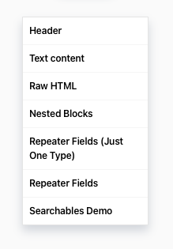

# Otter, an embeddable content editor 

[](https://travis-ci.com/bhallstein/otter)

Otter is perhaps the ~~furriest~~ easiest way in the universe to embed a content editor in your react/preact application.


*An Otter editor* 👆

- Create a full-blown content editor by simply ~~splashing about in a river~~ defining some content models 🏔
- Simple and ~~estuarine~~ declarative block-’n-field syntax for your models 🌿
- Generates post data in an ~adorable~ accessible JSON format 💧
- Delivered as a React component that’s really ~~into fish~~ easy to use 🐟

```jsx
🐟 🐟 🐟
npm i -S otter-editor --legacy-peer-deps
🐟 🐟 🐟
<Otter.Editor blocks={blocks}
              data={data}
              load_state={Otter.State.Loaded} />
🐟 🐟 🐟
```


### Contents

- [Otter.Editor](#ottereditor)
- [Blocks](#blocks)
- [Fields](#fields)
  - [TextInput](#field-types)
  - [TextArea](#field-types)
  - [TextEditor](#field-types)
  - [Bool](#field-types)
  - [Radios](#field-types)
  - [Select](#field-types)
  - [NestedBlock](#field-types)
  - [Repeater](#field-types)
  - [Searchable](#field-types)
  - [MediaPicker](#field-types)
- [Custom layout](#custom-layout)
- [Demo](#demo)
- [CSS and Tailwind](#css-and-tailwind)
  - [Custom CSS Classes](#custom-css-classes)
- [Selective importing](#selective-importing)
- [Tests](#tests)
- [Local development within another project](#local-development-within-another-project)
- [License](#license)


## <Otter.Editor>

The `<Otter.Editor />` element renders the editor.

```jsx
<Otter.Editor blocks={blocks}
              data={data}
              load_state={Otter.State.Loaded} />
```

| Property             | Value                                           | Required | Default          |                                                                                                                                    |
| :---------------     | :---------------------------------------------  | :------- | :--------------- | :--------------------------------------------------------------------------------------------------------------------------------- |
| `blocks`             | array of blocks                                 | Yes      |                  | Defines the [blocks](#blocks) available in the editor.                                                                             |
| `data`               | Loaded document data                            |          |                  | The loaded page data.                                                                                                              |
| `load_state`         | `Otter.State.Loading` or `.Loaded` or `.Error`  | Yes      |                  | Set the editor state. Use `Loading` and `Error` to display useful feedback to the user when asynchronously fetching content data.  |
| `block_numbers`      | `bool`                                          |          | `false`          | Label each block with its 1-based index                                                                                            |
| `add_block_msg`      | `string`                                        |          | `'Insert block'` | Label for the 'insert block' button                                                                                                |
| `can_add_blocks`     | `bool`                                          |          | `true`           | If set to false, the user cannot add or remove blocks. Useful if you want an editor with a single pre-programmed block.            |
| `custom_classes`     | `Object`                                        |          |                  | Allows you to specify custom CSS classes on a variety of editor elements. See [CSS](#css-and-tailwind) for details.                |
| `save`               | `function(data)`                                |          |                  | Save the document.                                                                                                                 |
| `update_height`      | `function(new_height_in_pixels)`                |          |                  | Called by Otter when the editor height changes, in case this is useful to you.                                                     |
| `open_media_library` | `function(set_value)`                           |          |                  | Called by Otter when a `MediaPicker` button is clicked. Call `set_value` to set the picked item.                                   |
| `dev_mode`           | `bool`                                          |          | `false`          | Add a button to copy a block's data to your clipboard. This lets you easily obtain a block's `initial_data`.                       |


## Blocks

The Otter editor is based on content models that you define. These **block definitions** are succinct and declarative. Within a block, there will be one or more [Fields](#fields). This system lets you rapidly arrange fields into blocks to create rich content editors.

An example Block of type `PageHeader` might contain the Fields: `title`, `subtitle`, and `background_image`.

```js
{
  type: 'MyBlock',
  description: 'My block',
  fields: [
    <Field>,
    <Field>,
    ...
  ],
}
```

### Block properties

| Property      | Value              | Required | Default |                                                                                                                                                                 |
| :------------ | :----------------- | :------- | :------ | :-------------------------------------------------------------------------------------------------------------------------------------------------------------- |
| `type`        | `<string>`         | Yes      |         | The block type identifier. Each block's `type` string must be unique within the editor.                                                                         |
| `description` | `<string>`         |          |         | A human-readable name for the block, identifying it clearly to the user. If not present Otter will use a prettified version of the block type.                  |
| `fields`      | `Array(<Field>)`   | Yes      |         | The [fields](#fields) in this block.                                                                                                                            |
| `initial_data`| `<object>`         |          |         | Optionally, provide initial data for the block.                                                                                                                 |
| `thumbnail`   | `<path>`           |          |         | Optional thumbnail for use in the [graphical block picker](#blocks-optionally-categorise-in-groups).                                                            |
| `hidden`      | `<bool>`           |          | `false` | If `true`, don't display this block in the block picker. This allows you to define blocks at the top level which can only be used in a NestedBlock or Repeater. |
| `tabs`        | `Array(<Tab>)`     |          |         | Allows you to arrange the block's fields into tabs. See [block tabs](#block-tabs).


### Block picker

When supplying your content blocks to Otter, (`<Otter.Editor blocks={blocks} />`), you can either use a **simple, flat array** of blocks, or **group them into categories**.

```js
// Simple blocks
const blocks = [
  <Block>,
  <Block>,
  ...
]
```

```js
// Grouped blocks
const blocks = {
  text: {
    name: 'Text blocks',
    blocks: [ <Block>, <Block>, ... ],
  },
  media: {
    name: 'Media blocks',
    blocks: [ <Block>, <Block>, ... ],
  },
}
```

- If simple blocks are provided, otter renders a popover-style block picker.
- If grouped blocks are provided, otter renders a popup-style, graphical block picker. This can provide a better user experience:

| Popover (simple) block picker        | Popup (grouped) block picker          |
| :----------------------------------- | :------------------------------------ |
|  |  |


### Block tabs

Within a block, fields may be grouped into **tabs**. This can help you keep the user experience clean when your blocks are more complex:

```js
// Create tabs:
// - 'Text' containing heading and subheading fields
// - 'Settings' containing align field
export const header_block = {
  type:      'Header',
  fields:    [
    { name: 'heading', ... },
    { name: 'subheading', ... },
    { name: 'align', ... },
  ]
  tabs: [
    {
      label: 'Text',
      fields: ['heading', 'subheading'],
    },
    {
      label:   'Settings',
      fields: ['align'],
    },
  ],
}
```


You can optionally use an icon instead of text to label your tab.
When using icon tab labels, the tab icons are placed inside the header of the Block or Repeater item, next to the delete button:

```js
export const header_block = {
  ...
  tabs: [
    {
      Icon: PencilSolid,
      fields: ['heading', 'subheading'],
    },
    {
      Icon:   CogSolid,
      fields: ['align'],
    },
  ],
}
```


## Fields

Each block should contain at least one field.

```js
{
  name: 'content',
  description: 'Content',
  type: Otter.Fields.TextArea,
}
```

### Field properties

Properties on fields:

| Property           | Value                                   | Required   |                                                                                                          |
| :----------------- | :-------------------------------------- | :--------- | :------------------------------------------------------------------------------------------------------- |
| `name`             | `<string>`                              | Yes        | The block data save key.                                                                                 |
| `description`      | `<string>`                              |            | Field label displayed to the user. If not present Otter will use a prettified version of the field name. |
| `type`             | `Otter.Field.<FieldType>`               | Yes        | The [field type](#field-types).                                                                          |
| `display_if`       | `<DisplayRule>`, `Array(<DisplayRule>)` |            | Show/hide this field based on the value(s) of its sibling(s).                                            |
| `default_value`*   | Any type, as appropriate                |            | A default value, used to set the field initially and to provide data on save if the field is empty.      |
| `placeholder`      | `<string>`                              |            | For text and textarea inputs.                                                                            |
| `wrapper_class`**  | `<string>`                              |            | Add custom classes to the field wrapper. See [custom layout](#custom-layout)                             |
| `label_class`**    | `<string>`                              |            | Add custom classes to the field label. See [custom layout](#custom-layout)                               |
| `field_class`**    | `<string>`                              |            | Add custom classes to the input or other field element. See [custom layout](#custom-layout)              |
| `mini`             | `<bool>`                                |            | Currently only supported on Select, TextInput and Number fields. Useful in combination with Radios etc.  |

- *(`default_value` is supported on all fields except: TextEditor, MediaPicker, NestedBlock, Repeater, Searchable.)
- **(`wrapper_class`, `label_class` & `field_class` are supported on all fields except: Repeater, NestedBlock. [See custom layout](#custom-layout).)

`type` should be specified using the Otter-defined constants: `type: Otter.Fields.TextInput`, etc. (See [field types](#field-types).)

With `display_if` you can show or hide the field based on the value of one or more of its siblings. Each `DisplayRule` specifies the name of the
sibling and a value. You can test against more than one sibling field using an array of multiple `DisplayRule` objects.

```js
// display_if example:
{
  name: 'url',
  description: 'URL',
  type: Otter.Fields.TextInput,
  display_if: {
    sibling: 'is_link',
    equal_to: true,
  },
}
```

Beside `equal_to`, DisplayRule supports these rule types:

| Rule type      | Value                            |                                                                            |
| :------------- | :------------------------------- | -------------------------------------------------------------------------- |
| `equal_to`     | `<value>`                        | Show the field if the sibling's value `=== <value>`                        |
| `not_equal_to` | `<value>`                        | ...if `!== <value>`                                                        |
| `matches`      | `<string> (compiled to RegExp)`  | Show the field if the sibling's value is a string which matches the regex  |
| `doesnt_match` | `<string> (compiled to RegExp)`  | ...which doesn't match the regex                                           |

Note that using `matches` and `doesnt_match` may impact the performance of typing into the targeted sibling field, as it causes relayout to occur on input.


### Field types:

The supported field types and their options are documented below.

| Type          | Description                                 | Options                        | Default        |                                                                                                |
| :------------ | :------------------------------------------ | :----------------------------- | :------------- | :--------------------------------------------------------------------------------------------- |
| `TextInput`   | Plain text input                            |                                |                |                                                                                                |
| `TextArea`    | Textarea (multi-line plain text)            |                                |                |                                                                                                |
|               |                                             | `mono` (bool)                  | `false`        | Use a monospace font                                                                           |
| `TextEditor`  | Rich text editor                            |                                |                |                                                                                                |
|               |                                             | `heading_levels` (array)       | `[1, 2]`       | Heading types to display in the paragraph style dropdown                                       |
|               |                                             | `bullets` (bool)               | `true`         | Enable bullets                                                                                 |
|               |                                             | `blockquote` (bool)            | `false`        | Enable blockquote                                                                              |
|               |                                             | `hr` (bool)                    | `false`        | Enable horizontal rule                                                                         |
|               |                                             | `paste_as_plain_text`          | `false`        | Clear text formatting on paste                                                                 |
| `Bool`        | A toggle                                    |                                |                |                                                                                                |
|               |                                             | `no_label` (string)            | `"Yes"`        | Label for `true` option                                                                        |
|               |                                             | `yes_label` (string)           | `"No"`         | Label for `false` option                                                                       |
| `Radios`      | Radio buttons                               |                                |                |                                                                                                |
|               |                                             | `options` (object)             |                | Radio options. Key pairs are in the form `value: "Label"`.                                     |
|               |                                             | `swatches` (bool)              | `false`        | Render as color swatches. Option values must be a valid CSS color, e.g. '#343434'.             |
|               |                                             | `icons` (object)               |                | Use icons to label the radios instead of labels. Format: `{opt_value: IconComponent, ...}`     |
| `Select`      | Select dropdown                             |                                |                |                                                                                                |
|               |                                             | `options` (object)             |                | Select options. Key pairs are in the form `value: "Label"`.                                    |
| `NestedBlock` | Embed another block into this block         |                                |                |                                                                                                |
|               |                                             | `nested_block_type` (string or Block object)    | | The block to embed inside this block. May be either a Block object or the string name of a block defined elsewhere in the blockset. |
|               |                                             | `optional` (bool)              | `false`        | If true, render a toggle that enables/disables the Nested Block                                |
|               |                                             | `seamless` (bool)              | `false`        | If false, a subtle border + padding surrounds the blocks contents, which can aid grouping (visually). If true there is no visual indication that a nested block has been used. |
| `Repeater`    | Embed an array of blocks within this block  |                                |                |                                                                                                |
|               |                                             | `nested_block_types` (array: strings or Block objects)  | | The blocks available in this Repeater. Value is an array of either Block objects or name strings of blocks defined elsewhere in the blockset. |
|               |                                             | `max` (number)                 | No limit       | Optionally limit the number of items the user can add.                                         |
|               |                                             | `item_headers` (bool)          | `false`        | If `true`, repeater items are rendered with a header displaying the name/description of the repeater field. Note: `'with_header'` is required to use icon tabs within repeater items. |
| `Searchable`  | Text input with custom search               |                                |                |                                                                                                |
|               |                                             | `search` (function -> promise) |                | A function that takes a search term as its argument, performs a search, and returns a promise. The promise should resolve to an array of search results in the form `{value, display}`. If the promise rejects, it should return an error message string which will be displayed to the user below the search field. |
|               |                                             | `debounce_ms` (number)         | `500`          | Adjust `search` callback rate limiting.                                                        |
| `MediaPicker` | Select item from media library              |                                |                | (Note: you must implement a media library, Otter does not include one.)                        |
|               |                                             | `label` (string)               | `"Select"`     | Button label.                                                                                  |

### Testing for optional repeaters and nested blocks

When an `optional` block is saved, the data item has an extra boolean property, `__enabled`. When outputting the document, templates can check this property to see if the block should be rendered or ignored:

```jsx
header.image.__enabled && 
```


## Custom layout

By default, fields take up the full width of their container, with the field label above the field.
You can customize this layout by passing classes to these field definition options: `wrapper_class`, `label_class`, `field_class`.

Fields are rendered in a `flex` container, which gives you a lot of power to customize how fields are laid out in a block.

For example, setting `wrapper_class='w-1/2'` would allow you to align two fields side by side horizontally.
Similarly, you could use `wrapper_class` and `label_class` to place the label next to the field instead of above it.

Note that you can easily break the layout using these options. You should take particular care over how layout behaves when the viewport
width changes.

For custom layout examples, see the [demo](#demo).


## Demo

The demo project in [/demo](demo/) renders a complete Otter editor, and demonsrates NestedBlock fields, Repeaters, and customisation options.

```bash
npm run demo
  # or: parcel demo/index.html
````


## CSS and Tailwind

Otter uses Tailwind (3.0) for styling. Ideally, your application should compile Tailwind.

When using your own compiled Tailwind, your bundle must also must import Otter’s small amount of its own CSS and that of the Quill editor:

```js
import 'otter/dist/css/quill.snow.css'
import 'otter/dist/css/otter.css'
``

If you are not compiling tailwind yourself, you can instead import everything (including a compiled copy of tailwind) from otter/dist:

```js
import 'otter/dist/css/all.css
```

(Note that while the all-in-one-go `all.css` method may be a quick way to get started, your project should ultimately take on the tailwind
compilation instead of relying on Otter to do so.)


### Custom CSS classes

You can customise the look and feel of the editor by passing a nested object of CSS classes to the `<Editor />` `custom_classes` prop.

```js
const custom_classes = {
  typography: {
    heading: 'font-bold tracking-tight',
  }
}
<Otter.Editor custom_classes={custom_classes} ... />
```

The demo includes a substantial example use of custom CSS classes, see [/demo/custom-classes.js](/demo/custom-classes.js).

For all support custom classes, see [/src/core/definitions/classes.js](/src/core/definitions/classes.js).


## Selective importing

Sometimes one of your application bundles may not need to import the whole of the Otter library.
You can import the field type definitions separately:

```js
import Fields from 'otter-editor/dist/core/definitions/fields'
```

And you can also import individual otter utils:

```js
import {set_dynamic_data} from 'otter-editor/dist/core/definitions/utils'
```


## Tests

```bash
npm run t   # run all tests
npm run tw  # run all tests, --watch
npm run ts src/test/<file>  # run a single test, --watch
```


## Local development within another project

- Delete `your-app/node_modules/otter-editor`
- From otter, run a build to generate CSS and initial JS:

```bash
DIST=/path/to/my-app/node_modules/otter-editor/dist LOCALDEV=yes bash scripts/build.sh
```

- If desired, then begin live-compiling from otter into DIST:

```bash
DIST=/path/to/my-app/node_modules/otter-editor/dist LOCALDEV=yes WATCH=y bash scripts/babel.sh
```


## License

To enable Wordpress integration, Otter is dual-licensed. The license is:

- GPLv2 for the purpose of embedding within Wordpress themes
- MIT for all other purposes

See [LICENSE.md](LICENSE.md).

